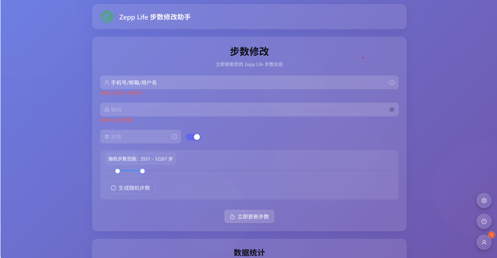

# Zepp-Life-Steps - API计费和统计系统

[](https://github.com/miloce/Zepp-Life-Steps)
[](https://github.com/miloce/Zepp-Life-Steps)
[](https://vercel.com/new/clone?repository-url=https://github.com/53039843/ze1)

> 通过Zepp Life（原小米运动）API实现了一个运动步数修改工具，支持邮箱和手机号登录方式，可实现同步运动步数至微信、支付宝等。

## 🎉 新增功能：API计费和统计系统

### ✨ 主要特性
- 💰 **API调用计费**：单次调用¥0.006，失败不扣费
- 📊 **统计仪表板**：实时查看调用统计、余额、成功率
- 📈 **可视化图表**：7天API使用趋势展示
- 💳 **易支付充值**：支持支付宝和微信支付
- 📝 **详细记录**：记录每次调用的IP、时间、状态

### 🚀 快速部署统计系统

点击上方按钮一键部署到Vercel，部署后访问：
- **统计仪表板**：`https://your-domain.com/dashboard-simple`
- **原步数修改页面**：`https://your-domain.com/`

**特点**：
- ✅ 无需登录，打开即用
- ✅ 固定演示账号（demo@zepp.com）
- ✅ 完全免费部署

详细文档：
- [Vercel部署指南](./VERCEL_DEPLOY.md)
- [功能说明文档](./BILLING_FEATURE.md)
- [测试报告](./TEST_REPORT.md)

---

> 通过Zepp Life（原小米运动）API实现了一个运动步数修改工具，支持邮箱和手机号登录方式，可实现同步运动步数至微信、支付宝等。

## 📱 在线体验

- [Web 版本](https://steps.luozhinet.com)
- 微信小程序：扫描下方二维码

## ✨ 功能特点

- 🎯 简洁美观的用户界面，操作简单直观
- 🔢 支持自定义步数，想改多少改多少
- 🚀 一键部署到 Vercel，零门槛使用
- 🔒 安全可靠，不会泄露您的账号信息
- 📊 支持历史记录查看
- 🔄 自动同步到微信、支付宝运动
- 🌐 提供API接口，支持POST和GET方式调用

## 📱 微信小程序版本

扫描下方二维码，即可使用微信小程序版本，随时随地修改步数！


## 📸 应用界面



## 📖 使用方法

### Web 版本

1. 访问我们的网站 [steps.luozhinet.com](https://s.xhy6.com)
2. 输入您的 Zepp Life 账号和密码
3. 设置您想要的步数
4. 点击提交，等待同步完成

### 微信小程序版本

1. 扫描上方二维码进入小程序
2. 登录您的 Zepp Life 账号
3. 设置步数并提交
4. 等待同步完成

### API接口调用

您可以通过POST或GET请求调用接口修改步数，非常适合集成到自动化工具中。

#### POST方式

```
POST /api/update-steps
Content-Type: application/json

{
  "account": "您的账号",
  "password": "您的密码",
  "steps": 步数值
}
```

#### GET方式

```
GET /api/update-steps?account=您的账号&password=您的密码&steps=想要的步数
```

**参数说明：**

| 参数名 | 类型 | 必填 | 说明 |
|-------|-----|------|------|
| account | string | 是 | Zepp Life 账号（邮箱或手机号） |
| password | string | 是 | 账号密码 |
| steps | number | 否 | 想要修改的步数（不填则随机生成20000-30000之间的步数） |

**示例：**

```
https://s.xhy6.com/api/update-steps?account=example@mail.com&password=yourpassword&steps=25000
```

**返回结果：**

```json
{
  "success": true,
  "message": "步数修改成功: 25000",
  "data": { ... }
}
```

## 🛠️ 本地开发

想要自己部署或者修改代码？没问题！

1. 克隆仓库：
```bash
git clone https://github.com/miloce/Zepp-Life-Steps.git
cd Zepp-Life-Steps
```

2. 安装依赖：
```bash
npm install
```

3. 运行开发服务器：
```bash
npm run dev
```

4. 打开浏览器访问 http://localhost:3000

## 🚀 部署到 Vercel

想要自己部署一个Vercel实例？超级简单！

[](https://vercel.com/import/project?template=https://github.com/miloce/Zepp-Life-Steps.git)

1. 将代码推送到 GitHub 仓库
2. 在 Vercel 中导入该仓库
3. Vercel 将自动部署你的应用

## 🚀 部署到腾讯云 CloudNative Builder (CNB)
>https://cnb.cool/

腾讯云原生构建（Cloud Native Build，简称 CNB）是腾讯新一代基于代码仓库的持续集成构建平台，它支持环境一致性、分支即环境、秒级启动、构建加速和开源协作等特性。这些特性使得开发者能够更加高效地进行软件开发，无论是持续集成、持续部署、持续交付、远程开发还是开源协作。
 

### [云原生构建（Cloud Native Build）为开发者提供免费算力资源支持](https://docs.cnb.cool/zh/saas/pricing.html#%E8%B5%84%E6%BA%90%E4%BD%BF%E7%94%A8%E8%B4%B9)

| 计费项   | 免费额度      | 使用场景            |
| ----- | --------- | --------------- |
| 仓库存储  | 100 GiB   | Git 对象          |
| 对象存储  | 100 GiB   | 制品、LFS 对象、图片及附件 |
| 云原生构建 | 160 核时/月  | 云原生构建           |
| 云原生开发 | 1600 核时/月 | 云原生开发           |

腾讯云提供的云原生构建工具也可以轻松部署本应用：

### 步骤一：云端快速初始化

1. 登录 cnb.cool 新建仓库


2. cnb.cool 提供了便捷的迁移工具。


3. 再选择 WebIDE 进入开发界面，方便快捷。


4. 按照提示，在云原生开发环境中执行以下命令迁移仓库，即可完成迁移。

```ssh
cnb-init-from https://github.com/miloce/Zepp-Life-Steps
```

 在执行上述命令后，您会在云原生开发环境的工作区中看到如下克隆与初始化日志：
 
### 步骤二：部署已有项目
在完成步骤一后，云原生开发环境会自动退出，此时需要重新在仓库页面点击"云原生开发"按钮，启动新的开发环境：


 ### 步骤三：端口转发与预览

 1. 在 CNB IDE 底部的 PORTS 面板，点击 `Add Port`，输入端口号 `3000` 并确认。
 2. 等待端口转发完成后，通过 `Forwarded Address` 链接即可在浏览器中访问应用。


 3. 进入转发的网页，填写zepplife账号密码以及步数进行提交。
 
 


## ⚙️ 使用前准备

1. 下载并注册 Zepp Life（原小米运动）应用
2. 在微信中启用微信运动功能
3. 在 Zepp Life 中将账户与微信运动绑定
   - 进入 Zepp Life 点击"我的"
   - 选择"第三方接入"
   - 点击"微信"，最后扫码完成绑定

## ⚠️ 注意事项

- 请合理使用，不要频繁修改步数，以免被系统检测
- 建议每次修改的步数不要超过合理范围（一般不超过 50000 步）
- 请妥善保管您的账号密码，不要分享给他人
- 本工具仅供学习和研究使用，请勿用于非法用途
- 使用本工具产生的任何后果由使用者自行承担
- 使用API接口时，请注意保护您的查询参数，建议在可信网络环境中使用

## 📝 免责声明

本工具仅供学习和研究使用，使用本工具所产生的任何后果由使用者自行承担。我们不对因使用本工具而导致的任何问题负责。

## 🤝 贡献

欢迎提交 Issue 和 Pull Request 来帮助改进这个项目！

## 📄 许可证

本项目采用 MIT 许可证。详情请参阅 [LICENSE](LICENSE) 文件。

## 🥰赞赏
如果你喜欢我的作品，请给予一些支持！

